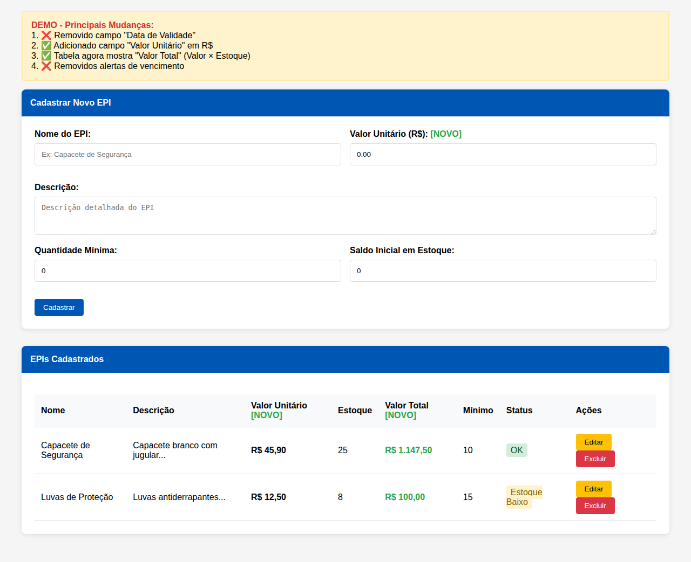
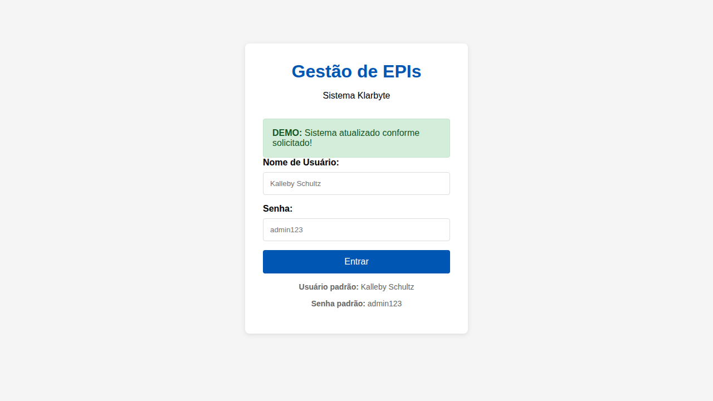

# EPIGestor - Sistema de Gestão de EPIs Klarbyte

## 📋 Sobre o Sistema

O EPIGestor é um sistema completo de gestão de Equipamentos de Proteção Individual (EPIs) desenvolvido para a empresa Klarbyte. O sistema permite o controle eficiente do estoque, movimentações, usuários e oferece um dashboard com estatísticas importantes para a gestão dos EPIs.

## ✨ Funcionalidades

### 🔐 Autenticação
- Sistema de login seguro com autenticação por nome de usuário e senha
- Controle de sessão para segurança dos dados
- Interface limpa e intuitiva para acesso ao sistema

### 📊 Dashboard Principal
- Visão geral dos EPIs cadastrados
- Valor total em estoque calculado automaticamente
- Alertas de estoque baixo
- Movimentações do dia
- Estatísticas importantes em cards informativos

### 🛡️ Gestão de EPIs
- Cadastro completo de EPIs com informações detalhadas
- Controle de estoque com quantidade mínima
- Gestão de valores unitários e cálculo automático de valor total
- Status automático baseado no estoque (OK/Estoque Baixo)
- Busca e filtros para facilitar a localização

### 📦 Movimentações de Estoque
- Registro de entradas, retiradas, devoluções e descartes
- Controle de responsável e empresa nas movimentações
- Histórico completo com observações
- Atualização automática do estoque

### 👥 Gestão de Usuários
- Cadastro e edição de usuários do sistema
- Controle de usuários ativos/inativos
- Senhas criptografadas para segurança

## 🖼️ Capturas de Tela

### Tela de Login
A tela de login oferece uma interface limpa e segura para acesso ao sistema:


### Interface de Gestão de EPIs
A interface principal para gestão de EPIs permite visualizar, cadastrar, editar e controlar o estoque:



### Dashboard Completo
O dashboard oferece uma visão geral completa do sistema com estatísticas e informações importantes:



## 🚀 Instalação e Configuração

### Pré-requisitos
- PHP 7.4 ou superior
- MySQL 5.7 ou superior (ou SQLite para desenvolvimento)
- Servidor web (Apache/Nginx) ou PHP Built-in Server

### Passos de Instalação

1. **Clone o repositório**
   ```bash
   git clone https://github.com/KallebySchultz/EPIGestor.git
   cd EPIGestor
   ```

2. **Configure o banco de dados**
   - Execute o script `database.sql` no seu MySQL
   ```bash
   mysql -u root -p < database.sql
   ```

3. **Configure a conexão**
   - Edite o arquivo `config.php` com suas credenciais de banco:
   ```php
   private $host = 'localhost';
   private $db_name = 'klarbyte_epi';
   private $username = 'seu_usuario';
   private $password = 'sua_senha';
   ```

4. **Inicie o servidor**
   ```bash
   # Para desenvolvimento
   php -S localhost:8080
   
   # Ou configure seu servidor web apontando para a pasta do projeto
   ```

5. **Acesse o sistema**
   - Abra o navegador e vá para `http://localhost:8080`
   - Use as credenciais padrão:
     - **Usuário:** Kalleby Schultz
     - **Senha:** admin123

## 🗄️ Estrutura do Banco de Dados

### Tabelas Principais

#### `usuarios`
- `id` - Identificador único
- `nome` - Nome completo do usuário
- `username` - Nome de usuário para login
- `senha` - Senha criptografada
- `data_criacao` - Data de criação do usuário
- `ativo` - Status do usuário (ativo/inativo)

#### `epis`
- `id` - Identificador único
- `nome` - Nome do EPI
- `descricao` - Descrição detalhada
- `valor_unitario` - Valor unitário do EPI
- `quantidade_minima` - Quantidade mínima em estoque
- `saldo_estoque` - Quantidade atual em estoque
- `data_criacao` - Data de cadastro
- `ativo` - Status do EPI (ativo/inativo)

#### `movimentacoes`
- `id` - Identificador único
- `epi_id` - Referência ao EPI
- `tipo_movimentacao` - Tipo (entrada/retirada/devolucao/descarte)
- `quantidade` - Quantidade movimentada
- `responsavel` - Nome do responsável
- `empresa` - Empresa relacionada
- `observacoes` - Observações da movimentação
- `data_movimentacao` - Data/hora da movimentação
- `usuario_id` - Usuário que fez a movimentação

## 🔧 Funcionalidades Técnicas

### Segurança
- Sanitização de dados de entrada
- Senhas criptografadas com `password_hash()`
- Proteção contra SQL Injection com prepared statements
- Controle de sessão PHP

### Recursos
- Interface responsiva com CSS moderno
- Cálculos automáticos de valores
- Formatação de moeda brasileira
- Alertas visuais para status de estoque
- Busca e filtros em tempo real

### Status de EPIs
- **✅ OK**: Estoque normal, acima da quantidade mínima
- **⚠️ Estoque Baixo**: Estoque igual ou abaixo da quantidade mínima

## 📈 Estatísticas do Dashboard

O dashboard apresenta as seguintes informações:

1. **Total de EPIs**: Quantidade de EPIs cadastrados ativos
2. **Valor Total em Estoque**: Soma de todos os valores em estoque (valor_unitario × saldo_estoque)
3. **Estoque Baixo**: Quantidade de EPIs com estoque abaixo do mínimo
4. **Movimentações Hoje**: Total de movimentações registradas no dia

## 🔄 Tipos de Movimentação

- **Entrada**: Incorporação de novos EPIs ao estoque
- **Retirada**: Saída de EPIs do estoque para uso
- **Devolução**: Retorno de EPIs ao estoque
- **Descarte**: Remoção permanente de EPIs (vencidos/danificados)

## 🎨 Interface do Usuário

O sistema conta com uma interface moderna e intuitiva:

- **Design responsivo** que funciona em desktop e mobile
- **Cores consistentes** com a identidade visual da Klarbyte
- **Navegação intuitiva** com menu principal sempre visível
- **Alertas visuais** para diferentes status e ações
- **Tabelas organizadas** com informações claras e ações rápidas

## 🛠️ Estrutura de Arquivos

```
EPIGestor/
├── config.php          # Configuração do banco e funções auxiliares
├── database.sql         # Script de criação do banco de dados
├── login.php           # Página de autenticação
├── dashboard.php       # Dashboard principal
├── epis.php           # Gestão de EPIs
├── movimentacoes.php  # Gestão de movimentações
├── usuarios.php       # Gestão de usuários
├── logout.php         # Logout do sistema
├── style.css          # Estilos CSS
├── index.html         # Página inicial de redirecionamento
└── README.md          # Documentação (este arquivo)
```

## 📞 Suporte

Este sistema foi desenvolvido para a **Klarbyte** com foco na gestão eficiente de EPIs.

Para suporte ou dúvidas sobre o sistema, entre em contato através do repositório GitHub.

---

**Desenvolvido com ❤️ para a gestão eficiente de EPIs**